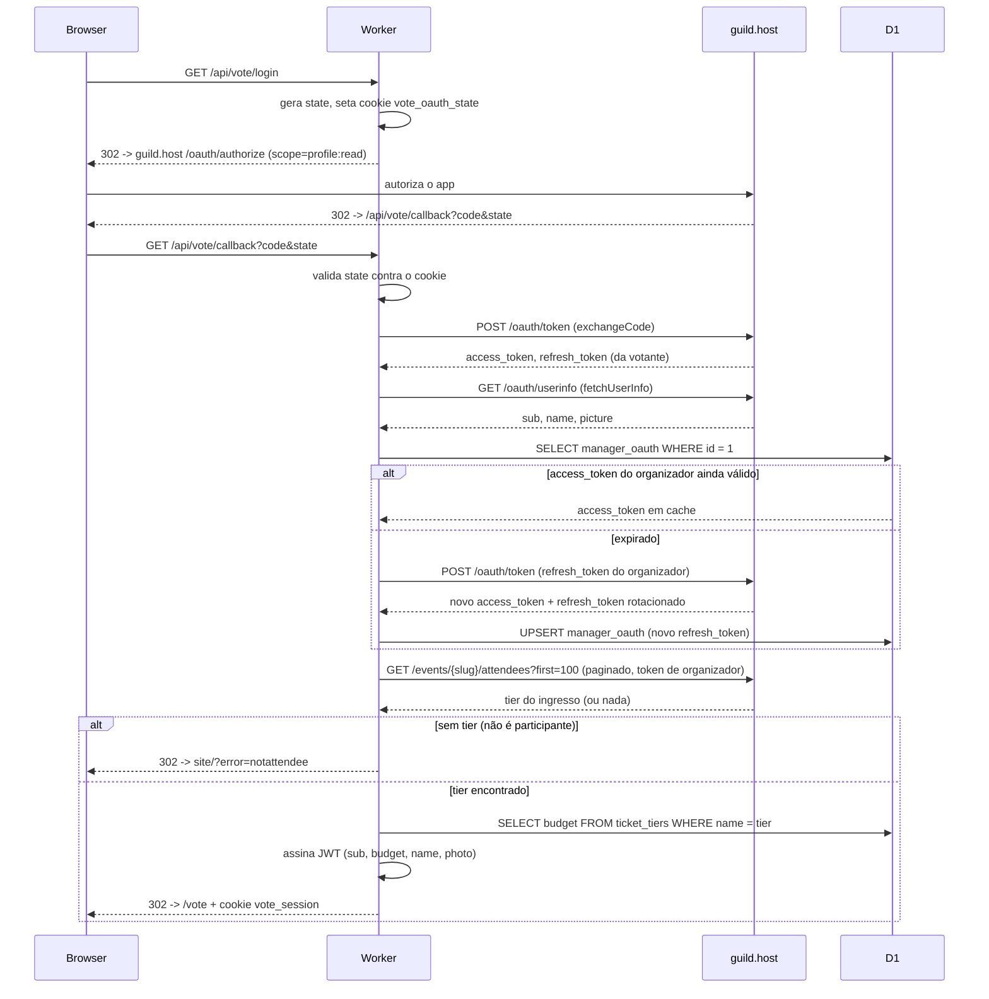
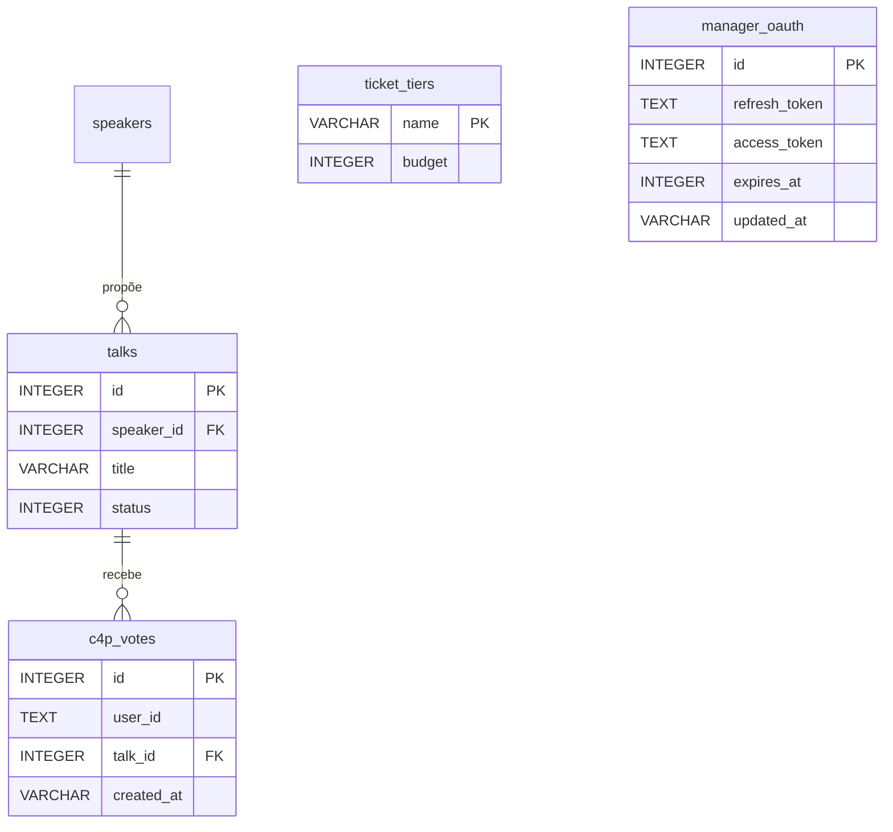

# Desenvolvimento do site

Este repositório contém o **código-fonte** do site oficial da **JSConf Brasil** ([jsconf.com.br](https://jsconf.com.br)): páginas em **Docusaurus**, conteúdo multilíngue e um **Worker** (Cloudflare) para formulários e API. Aqui você encontra como rodar o projeto localmente, traduzir textos e validar o build antes de abrir um PR.

---

## Primeiros passos

```sh
npm ci
npm start # Inicia o website e o servidor localmente (pt-BR)
```

---

### Idiomas

```sh
npm run start:en # Inglês
npm run start:es # Espanhol
```

> [!TIP]
>
> Use o componente `<Image />` ao invés de `` para visualizar as imagens corretamente em todos os idiomas durante o desenvolvimento.
>
> - O componente `<Image />` utiliza `loading="lazy"` e `decoding="async"` por padrão.

---

### Traduções (i18n)

Use `<Text />` para conteúdo JSX e `text()` para atributos HTML (`aria-label`, `alt`, `placeholder`, etc.):

```tsx
<h1>
  <Text id='speakers.title' />
</h1>
```

```tsx
<Image alt={text({ id: 'location.venue.imgAlt' })} />
```

`<Text />` e `text()` são abstrações do [`<Translate />`](https://docusaurus.io/docs/docusaurus-core#translate) do **Docusaurus**:

- IDs tipados com autocomplete a partir de `i18n/pt-BR/code.json`
- Fallback automático do idioma principal (`pt-BR`) — não é necessário passar `children`

Para adicionar um novo texto:

1. Crie a chave em `i18n/pt-BR/code.json`
2. Use `<Text id='...' />` ou `text({ id: '...' })` no componente
3. Os tipos são inferidos automaticamente usando `i18n/pt-BR/code.json` como fonte de verdade

---

### Formatação / Linting

```sh
npm run lint:fix
```

---

## Compilação

```sh
npm run build # Compila o website e o worker
```

---

## Testes

```sh
npm test # Testes unitários
```

```sh
npm run typecheck # Verificação de tipos TypeScript
```

```sh
npm run lint # Verificação de linting
```

---

## Votação de palestras

Quem comprou ingresso vota nas palestras do C4P em `/vote`. A pessoa entra com a conta do **guild.host**, e quantos votos ela tem depende do **tier** do ingresso. O fluxo já está implementado de ponta a ponta e foi verificado contra um login real no guild.host.

O site (Docusaurus) e o Worker são dois deploys separados. O navegador nunca fala com o D1 diretamente, só com a API JSON do Worker. As rotas relevantes, registradas no `switch` de `src/server/index.ts` e implementadas em `src/server/routes/auth.ts` e `src/server/routes/vote.ts`:

| Rota                     | Handler                                                        |
| ------------------------ | -------------------------------------------------------------- |
| `GET /api/vote/login`    | `authLogin` — inicia o OAuth                                   |
| `GET /api/vote/callback` | `authCallback` — troca o code, resolve o tier, assina a sessão |
| `GET /api/vote/me`       | `authMe` — identidade da sessão atual (página de conta)        |
| `GET /api/vote/logout`   | `authLogout` — limpa o cookie de sessão                        |
| `GET /api/vote`          | `voteGet` — lista as palestras votáveis + votos da pessoa      |
| `POST /api/vote`         | `voteSubmit` — registra/remove um voto                         |

### Duas identidades OAuth diferentes

Esta é a parte que mais confunde: o login usa **dois** tokens OAuth com escopos diferentes, um por pessoa (a votante) e um único fixo do lado do servidor (o organizador).

1. **Token da votante** — escopo `profile:read` apenas (`OAUTH_SCOPE` em `src/server/configs/oauth.ts`). Usado uma única vez no login pra chamar `/oauth/userinfo` do guild.host e pegar `{ sub, name, picture }`. Nunca é guardado.
2. **Token de organizador** — necessário porque o único lugar que expõe o tier do ingresso é `/events/{slug}/attendees`, e esse endpoint exige permissão de organizador do evento (escopo `event_attendees:read`, `MANAGER_SCOPE`) — algo que uma votante comum nunca tem. O Worker mantém uma credencial fixa pra isso:
   - `GUILD_ORG_REFRESH_TOKEN` é um secret de **bootstrap**, capturado uma única vez por um fluxo só-dev: acessar `/api/vote/login?manager=1` pede o `MANAGER_SCOPE`, e o callback (gated por `env.ENVIRONMENT !== 'production'` + um cookie `vote_manager_capture`) imprime o refresh token em texto puro no navegador em vez de assinar uma sessão. Esse valor nunca é logado em lugar nenhum.
   - `managerAccessToken()` (`src/server/helpers/oauth.ts`) lê a única linha (`id = 1`) da tabela D1 `manager_oauth`. Se o `access_token` em cache ainda não expirou, reusa sem chamar a rede. Senão, faz um `POST grant_type=refresh_token` no endpoint de token do guild.
   - **Crítico:** o guild.host **rotaciona o refresh token a cada uso** — o antigo é revogado e um novo é emitido na mesma resposta. Por isso todo refresh bem-sucedido **grava o novo `refresh_token` de volta** na linha de `manager_oauth` (`INSERT ... ON CONFLICT DO UPDATE`). A env var só serve de semente; depois do primeiro uso, o D1 é a fonte de verdade e se auto-atualiza para sempre. Sem isso, o primeiro refresh já mataria o token guardado no `.dev.vars`/secret e quebraria a busca de tier até alguém recapturar o token manualmente.

### Fluxo de login completo



Passo a passo:

1. `GET /api/vote/login` (sem `?dev`/`?manager` em produção) — o Worker gera um `state` aleatório, seta o cookie `vote_oauth_state` (`SameSite=Lax`, 10min) e redireciona pro `/oauth/authorize` do guild.host com `client_id`/`redirect_uri`/`scope=profile:read`/`state`.
2. A pessoa autoriza no guild.host e é redirecionada pra `GET /api/vote/callback?code=...&state=...`.
3. O Worker confere que o `state` bate com o cookie, troca o `code` pelo par `{ access_token, refresh_token }` da votante (`exchangeCode()`).
4. `fetchUserInfo(access_token)` — `{ id (sub), name, picture }` do `/oauth/userinfo` do guild.
5. `managerAccessToken(...)` — obtém (ou renova) o token de organizador, lendo/gravando `manager_oauth` no D1 (ver seção acima).
6. `fetchTicketTier(managerToken, EVENT_SLUG, identity.id)` — pagina `/events/{slug}/attendees?first=100` (recursivo, até 30 páginas) procurando o nó cujo `userId` é o da votante, e retorna `node.ticketOrder.eventTicketOrderItems.nodes[0].eventTicketingTier.name`, ou `null` se não houver pedido de ingresso.
7. Sem tier → redireciona pra home com `?error=notattendee` (nenhuma sessão é assinada). Com tier → `budgetForTier(tier)` consulta a tabela `ticket_tiers` no D1 (qualquer tier sem linha lá recebe `1` por padrão).
8. `signSession(id, budget, secret, ttl, { name, photo })` assina um JWT (HS256, via `jose`) com o **budget já embutido**. Seta o cookie `vote_session` (`SameSite=None; Secure`, 24h) e redireciona pra `/vote`.
9. **Cuidado:** como o budget fica embutido no JWT no momento do login, mudar o budget de um tier no banco **não afeta quem já está logado** — a pessoa precisa deslogar e logar de novo pra pegar um JWT novo com o budget atualizado. Isso já aconteceu de verdade em teste, não é hipotético.
10. Caminhos de erro (todos redirecionam pra home com um `?error=`, exibido por um handler global na navbar que lê o query param e limpa ele em seguida): `?error=denied` (recusou no guild.host), `?error=state` (state não bate, possível CSRF), `?error=token` (troca do code falhou), `?error=identity` (userinfo ou token de organizador falhou), `?error=notattendee` (sem ingresso pra este evento).

### Autenticação a cada request (depois do login)

`getSession()` (`src/server/helpers/session.ts`) lê o cookie `vote_session`, verifica o JWT (`jose`) e retorna `{ userId, budget, name, photo }` direto das claims do token — **sem** chamada ao D1 nem ao guild a cada request. É por isso que `GET /api/vote` e `GET /api/vote/me` são rápidos.

- **Bypass só-dev:** fora de `production`, um header `X-Dev-User` retorna uma sessão fixa sem precisar de cookie — útil pra testar via `curl` sem login de verdade:
  ```sh
  curl -H 'X-Dev-User: user-1' localhost:8787/api/vote
  ```
- **Login-stub só-dev:** `GET /api/vote/login?dev=1` (mesmo gate de ambiente) assina uma sessão fixa (`dev-user`) direto, sem passar pelo guild — útil pra testar a UI do `/vote` no navegador.

### A votação em si

- `GET /api/vote` (`voteGet`) — exige sessão; retorna `{ budget, used, talks, myVotes, closesAt }`. `listTalks()` (`src/server/repositories/vote.ts`) só seleciona palestras com `status = 2` (`VOTABLE_TALK_STATUS`, em `src/server/configs/vote.ts`) e **deliberadamente não faz join** com `speakers` — a API nunca pode expor quem propôs a palestra, pra evitar viés. O frontend (`src/website/pages/vote/index.tsx`) gera, por palestra e a cada fetch, um nome fake com cara de nome (tipo "Aabd Cdaes", não é um nome real) e mostra ele borrado via CSS (`.speaker-name { filter: blur(...) }`) — isso é só estético/cosmético, não é um controle de segurança, já que nada sensível estava sendo escondido (o nome real nunca chegou a ser enviado).
- `POST /api/vote` (`voteSubmit`) — corpo `{ talkId, action: 'add' | 'remove' }`, validado com `zod`. Checa `isVotingOpen()` (`VOTE_CLOSES_AT` em `src/server/configs/vote.ts`, uma data ISO fixa no código — mudar a data exige deploy, de propósito, já que muda raramente). `castVote()` (`src/server/repositories/vote.ts`) confere o número de votos atual contra o budget (422 se já bateu o limite) e faz `INSERT OR IGNORE` em `c4p_votes`. `removeVote()` só faz `DELETE`, sem checagem de budget.
- **UX do frontend:** clicar no botão de votar de uma palestra vira o estado local na hora (otimista) e enfileira `{ talkId, action }` numa fila com debounce (1s de espera, reseta a cada novo clique), então uma rajada de cliques vira uma única leva de requests em vez de um request por clique. Isso existe porque, em dev local, o rate limiter compartilha um único bucket entre todos os requests quando não há header `CF-Connecting-IP` — é uma peculiaridade real de dev local, não acontece em produção (a Cloudflare sempre seta esse header lá). Quando o budget acaba, todo card de palestra ainda não votada fica esmaecido e desabilitado (classe CSS `budget-out`), exceto as já votadas, que continuam clicáveis pra desvotar — desvotar reabilita tudo na hora, sem refetch, é tudo derivado do estado local.

### Banco de dados



Ver `resources/schema.sql` pras colunas exatas. Tabelas relevantes pra votação:

- **`talks`** — a coluna `status` controla visibilidade (só `status = 2` entra na votação); a API de voto nunca faz join com `speakers`.
- **`ticket_tiers`** — `name` (`VARCHAR(200) PRIMARY KEY`, precisa bater exatamente com o nome do tier no guild.host) e `budget`. É uma tabela de **overrides**: `budgetForTier()` retorna `1` por padrão pra qualquer tier sem linha aqui, então só vale adicionar linha pros tiers que têm budget diferente de `1`.
- **`c4p_votes`** — `user_id` é o `sub` (UUID) do guild.host, `talk_id` referencia `talks`, e `UNIQUE(user_id, talk_id)` impede voto duplicado.
- **`manager_oauth`** — tabela de uma linha só (`id INTEGER PRIMARY KEY CHECK(id = 1)`) que guarda o refresh token rotativo do organizador, o access token em cache e a expiração.

### Operações administrativas

Rode com `npx wrangler d1 execute jsconf-br --file=<arquivo.sql>` (adicione `--remote` pra produção).

- **Adicionar uma palestra votável:** insira o speaker, depois a talk com `status = 2`.

  ```sql
  INSERT INTO speakers (name, email, phone, city, state, travel_pref, experience, bio)
  VALUES ('Nome', 'email@exemplo.com', '11999999999', 'São Paulo', 'SP', 0, 1, 'Bio curta.');

  INSERT INTO talks (speaker_id, duration, title, description, audience_level, reason, status)
  VALUES (last_insert_rowid(), 0, 'Título da palestra', 'Descrição.', 1, 'Motivo.', 2);
  ```

- **Esconder uma palestra (mantendo os votos):**
  ```sql
  UPDATE talks SET status = 0 WHERE id = 42;
  ```
- **Mudar o budget de um tier:**
  ```sql
  UPDATE ticket_tiers SET budget = 3 WHERE name = 'Nome exato do tier no guild.host';
  ```
  Lembrando do aviso acima: quem já logou antes da mudança só pega o novo budget deslogando e logando de novo.
- **Mudar o prazo de votação:** editar `VOTE_CLOSES_AT` em `src/server/configs/vote.ts` (exige código + deploy).

### Limitação conhecida: ingressos múltiplos

`fetchTicketTier` retorna o tier do **primeiro** nó de participante que bater na lista paginada do guild, não uma agregação/melhor-tier, caso a mesma pessoa apareça mais de uma vez na lista de participantes do evento. Isso ainda não foi testado na prática (só contas com um único ingresso foram usadas nos testes até agora) — é uma limitação conhecida, não um bug observado.

Secrets do Worker: `GUILD_OAUTH_CLIENT_ID`, `GUILD_OAUTH_CLIENT_SECRET`, `GUILD_OAUTH_REDIRECT_URI`, `GUILD_ORG_REFRESH_TOKEN`, `SESSION_SECRET`. O `ALLOWED_ORIGIN` precisa ser a origem do site (não pode ser `*`, senão o cookie de sessão não vai).

### Variáveis de ambiente (dois arquivos)

São dois arquivos, cada um com um dono diferente — não misture:

- **`.dev.vars`** — secrets de _runtime_ do Worker, carregados automaticamente pelo `wrangler dev`. É onde ficam `GUILD_OAUTH_*`, `SESSION_SECRET`, `ALLOWED_ORIGIN` e `ENVIRONMENT` no dev local. Modelo: `.dev.vars.example`. Em produção esses valores vêm do `wrangler secret put`, **não** de nenhum `.env`.
- **`.env`** — vars de _build/deploy_ lidas pelos scripts (`tools/prepare-worker.mts`) e pelo CD: `CLOUDFLARE_ACCOUNT_ID`, `CLOUDFLARE_API_TOKEN`, `WORKER_D1`, `WORKER_DOMAIN`. Modelo: `.env.example`.

Os secrets de OAuth/sessão só entram no `.dev.vars` — não os coloque no `.env`, nada os lê de lá. Os dois arquivos são gitignored.

Rodando local: `npm run db:init` cria as tabelas.

> [!TIP]
>
> O passo a passo pra subir em produção (registrar o app OAuth, popular `ticket_tiers`, pegar o refresh token de organizador) está no `TODO.md`.
